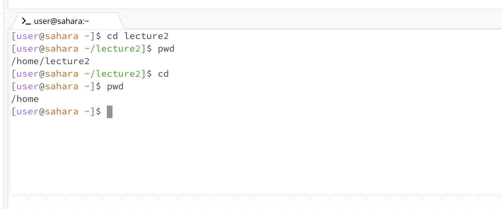
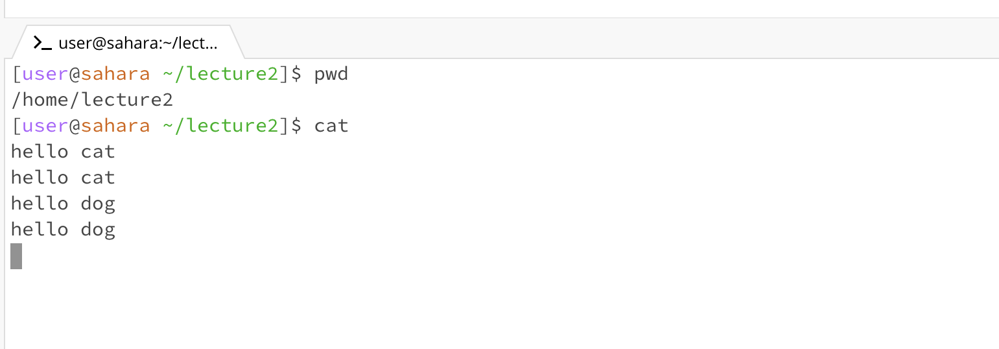

**LAB REPORT 1 - Remote Access and FileSystem**  
Emma Nguyen - PID 18021060

- Here are some basic filesystem commands I've learned from the lab:
   - Use "git clone" to clone/copy files and directories from a Github repository to a local computer by using key work "git clone" and follow by directory link.

   - Use "pwd" command to show the current working directory.
   - Use "cd" command to change the working directory.
   - Use "ls" command to list the files in the directory.
   - Use "cat" command to read a file.
   - Use "java" command to run a .java file on terminal.
- In addition, we've learned to create new file, upload files or images on gitHub.

1. **Example of using "cd" command with no argument:**
    
   - Working directory before running the command: /home/lecture2
   - When the command was run, the directory was changed to the home directory. Because the "cd" command with no argument will change the directory to the home directory.
   - Working directory after running the command: /home
     
2. **Example of using "cd" command with a path to a directory as an argument:**
    
   - Working directory
   - When the command was run with an argument, the directory was changed to the new directory (lecture2/) which is indicated in the argument.
     
4. **Example of using "cd" command with a path to a file as an argument:**
    
   - When the command was run with a file as an argument, the output showed an error because a file is not a directory. The "cd" command only works with changing the current directory to a new directory (or go back to /home).
     
5. **Example of using "ls" command with no argument:**
   
   - When the "ls" command was run with no argument, the output was the names of files and folders at the working directory.
     
6. **Example of using "ls" command with a path to a directory as an argument:**
   
   - When the "ls" command was run with a path to a directory as an argument, the output was the name of files and folder in that directory (not the current directory).
     
7. **Example of using "ls" command with a path to a file as an argument:**
   
   - When the "ls" command was run with a path to a file, the output was also the path to a file. The output will change if the path to a file is changed.
   - If the path to a file is an absolute path or relative path, the output is also an absolute path or relative path to that file, respectively.
     
8. **Example of using "cat" command with no argument:**
   
   - When a "cat" command was run with no argument, it was waiting for the input from user and there was no output yet. When I inputted something and hit enter, the output displayed the same content that I've inputted. So I think the "cat" command is just read what the user input and display it again (which is not very useful)
   
9. **Example of using "cat" command with a path to a directory as an argument:**
   -
   - When a "cat" command was run with a path to a directory as an argument, the ouput was an error since "cat" command only works with a path to a file, not a directory.
10. **Example of using "cat" command with a path to a file as an argument:**
   -
   - When a "cat" command was run with a path to a file as an argument, the output was the content of the file.
    
